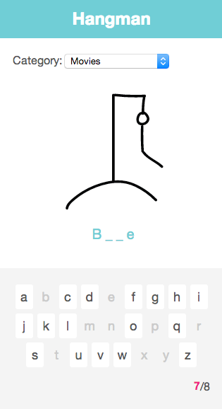

Angular Hangman TDD Demo
==========================

1. [Abstract](#abstract)
2. [Installation](#installation)
3. [Usage](#usage)
4. [Game API](#game-api)
4. [Technology stack](#technology-stack)
5. [Demo](#demo)
6. [Tests](#tests)
7. [Live Demo Version](#live-demo-version)


## Abstract

I wrote this project as a demo project for a talk give titled "TDD in javascript - Not a myth"
It was written TDD mode from scracth using yeoman [wix-angular generator](https://github.com/wix/generator-wix-angular)

This project features:

* Unit testing using jasmine
	* 	Testing http requests and mocking their responses
* E2E testing using protractor
	*   Using angular ngMockE2E module for writing mock server 
* Building mocks for various services

And more..



## Installation

After you cloned this project, navigate into the project folder and run the following commands in the shell

```sh
npm install
bower install
bundle install
grunt serve
``` 
## Usage

1. run grunt serve in your root directory of the project
2. open `http://localhost:9000`
3. switch to mobile mode (in chrome dev tools press the mobile icon on the top left corner)

## Game API
To demonstrate how to work with a server the game call 2 endpoints.

* GET /api/categories
	* Returns array of all categories keys

***Response Example:*** 

```javascript
['famousCats', 'capitals', 'movies', 'popes']
```

* GET /api/categories/{{category}}/words
	* Returns array of phrases in that category

***Response Example:***

```javascript
['Francis', 'Benedict XVI', 'St John Paul II']
```


## Technology stack

* Package managers:
	* Bower
	* npm
* Testing:
	* karma - test runner
	* jasmine - js testing framework
	* protractor - e2e tests
	* phantomjs - headless browser
* Build tools:
	* grunt
	* yeoman
	
## Demo

Coming soon

## Tests

For unit tests please see `test/spec` folder.

For E2E tests please see `test/e2e/spec` folder.

## Live Demo Version

In my talks I gave on [NG-NL Conf](http://www.ng-nl.org/) and [AngularJS IL](https://www.youtube.com/watch?v=olxbXe-eL2o) I created a mini-me version of this project. You can check it out [here](https://github.com/ofirdagan/hangman-live-demo)